# CICLUS v2.0
*CICLUS* é um software local desenvolvido para o acompanhamento do ciclo de vida de equipamentos laboratoriais na empresa **Suporte**, proporcionando acesso rápido e fácil às informações e oferecendo total visibilidade do histórico e do status de cada equipamento. Seu principal objetivo é permitir pesquisas ágeis e precisas sobre qualquer equipamento.

O software adota o mesmo padrão de identificação e categorização utilizado na aplicação principal da empresa, [**Sond**](https://www.sond.com.br), garantindo consistência e integração com os processos já existentes.

## Novidades (v2.0)
- Código Executável
- Novo README.

## 📖 Sumário

- [Funcionalidades Principais](#funcionalidades-principais)  
- [Tecnologias Utilizadas](#tecnologias-utilizadas)  
- [Como Usar](#como-usar)  
- [Manual do Usuário](#manual-do-usuário)  
  - [Tela de Equipamentos](#tela-de-equipamentos)  
    - [Representação Visual dos Status](#representação-visual-dos-status)  
    - [Interações por Equipamento](#interações-por-equipamento)  
    - [Botões de Funções Principais](#botões-de-funções-principais)  
    - [Campo “Modelo” vs. “Modelo Técnico”](#campo-modelo-vs-modelo-técnico)  
    - [Barra de Pesquisa por Múltiplos Fatores](#barra-de-pesquisa)
    - [Direcionamento para o Ciclo de Vida](#direcionamento-para-o-ciclo-de-vida)  
  - [Tela de Itens (Ciclo de Vida)](#tela-de-itens-ciclo-de-vida)  
    - [Estrutura da Lista de Itens](#estrutura-da-lista-de-itens)  
    - [Criação de Itens do Ciclo de Vida](#criação-de-itens-do-ciclo-de-vida)  
    - [Tipos de Item](#tipos-de-item)  
    - [Atualização automática de metadados](#atualização-automática-de-metadados)  
  - [Exportação (EXCEL e CSV)](#exportação-excel-e-csv)  
  - [Gráficos](#gráficos)  
  - [Plano de Calibração](#plano-de-calibração)  
- [Estrutura do Projeto](#estrutura-do-projeto)  
- [Armazenamento de Dados (Model)](#armazenamento-de-dados-model)  
- [Controle de Dados (Controllers)](#controle-de-dados-controllers)  
- [Atualizações](#atualizações)
- [Licença](#licença)
- [Contato](#contato)

## Funcionalidades Principais

*CICLUS* oferece controle completo do ciclo de vida de equipamentos laboratoriais, permitindo:

- Visualizar rapidamente todos os equipamentos com informações essenciais como status, calibração e modelo.
- Criar e editar equipamentos e registros de histórico de forma ágil e prática.
- Realizar buscas avançadas por múltiplos critérios para localizar equipamentos específicos.
- Acompanhar o histórico de cada equipamento com visão clara e organizada.
- Atualizar automaticamente informações relevantes ao adicionar novos registros, simplificando a manutenção dos dados.
- Exportar todos os dados dos equipamentos e seus itens diretamente para arquivos Excel, facilitando a análise e compartilhamento das informações.


## Tecnologias Utilizadas
- **Python**: Linguagem principal do software
- **TKinter**: Criação da interface gráfica.
- **SQLite3**: Banco de dados local para armazenamento rápido e leve.
- **Matplotlib**: Criação de gráficos para análise.

## Como transportar o projeto para seu computador local.

Você pode tanto seguir os seguintes passos utilizando GIT quanto baixar diretamente os arquivos e transportar para o local desejado.

1. Clone o repositório:
```bash
git clone https://github.com/LuanSFMarques/CICLUS
```

2. Navegue até a pasta do projeto:
```bash
cd CICLUS
```

3. instale dependências:
```bash
pip install -r requirements.txt
```

4. execute o programa:
```bash
python main.py
```
ou
```bash
py main.py
```

## Manual do Usuário
O Ciclus é um software de visualização de equipamentos e seu histórico, estruturado em duas abas principais:
- Tela de Equipamentos
- Tela de itens de Ciclo de Vida

O objetivo do sistema é fornecer informações sobre os equipamentos de maneira rápida e prática, priorizando velocidade de acesso e facilidade de visualização em vez de detalhamento inicial extenso.

---

### Tela de Equipamentos

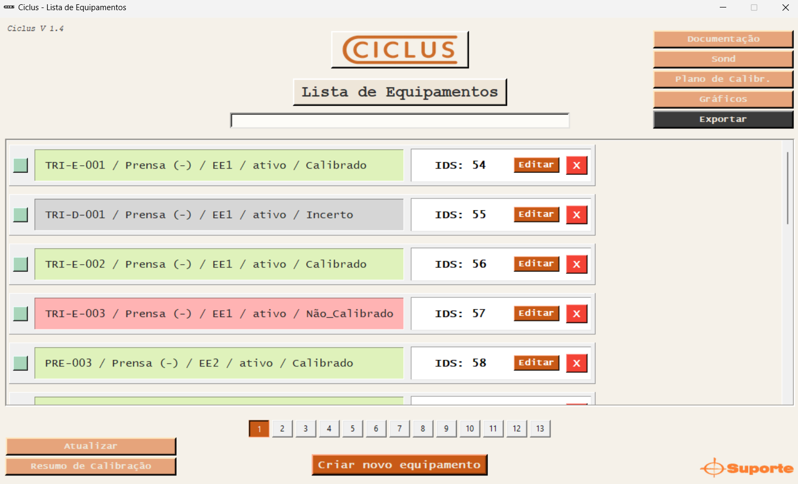

Ao iniciar o programa, a Tela de Equipamentos é exibida. Nela, cada equipamento apresenta as seguintes informações:
- Nome do equipamento: Nome principal exibido na SOND.
- Tipo de equipamento
- Modelo do equipamento: Identificação simplificada (não técnico) para fácil referência.
- Sigla do setor
- Status ativo/inativo
- Status de calibração

#### Representação Visual dos Status
Os dois últimos atributos são representados graficamente por cores, para rápida interpretação:
- Status de atividade
    - Quadrado menor à esquerda
    - Verde: ativo
    - Vermelho: inativo
- Status de calibração:
    - Retângulo maior à direita
    - Verde: calibrado
    - Vermelho: não calibrado
    - Azul: especial (não necessita calibração convencional)
    - Cinza: incerto (informação de calibração não disponível)

*Nota*:
- *Equipamentos com status “incerto” não possuem informações suficientes para determinar a calibração.*
- *Equipamentos “especiais” não seguem o procedimento de calibração tradicional (ex.: casagrande, peneiras de fundo).*
- *As cores permitem que o usuário identifique rapidamente o status sem necessidade de leitura detalhada.*

#### Interações por Equipamento
Cada equipamento inclui:
- ID (identificação na SOND)
- Botão Editar: Permite alterar todas as informações, exceto o ID
- Botão Excluir: Remove o equipamento e todos os itens relacionados no ciclo de vida

A lista exibe até 20 equipamentos por página. Itens adicionais são distribuídos em páginas subsequentes, acessíveis pelos botões de navegação na parte inferior.

#### Botões de Funções Principais
- *Atualizar*: Sincroniza os dados exibidos com o banco de dados, garantindo que alterações recentes sejam refletidas na tela.
- *Resumo de Calibração*: Exibe um resumo geral dos equipamentos ativos, incluindo contagem de calibrados, não calibrados, incertos e especiais.
- *Criar Equipamento*: Abre um formulário para cadastrar um novo equipamento.

**Atenção ao cadastrar novos equipamentos:**
- **O ID deve ser único; o sistema não permite duplicações.**
- **Equipamentos devem ter periodicidade definida; caso não haja, utilize o valor padrão de 12 meses.**

#### Campo “Modelo” vs. “Modelo Técnico”
- *Modelo Técnico*: Valor completo presente na SOND, contendo informações detalhadas do equipamento.
- *Modelo (simplificado)*: Identificação direta e fácil de utilizar.
    - *Ex.: Uma peneira com modelo técnico "abert 1,18mm malha 16" pode ter o modelo simplificado "16" para referência rápida.*
- O modelo simplificado é exibido na lista de equipamentos, facilitando a visualização e identificação.

#### Barra de Pesquisa
Na barra de pesquisa dos equipamentos é utilizado um algoritmo que permite buscas por múltiplos fatores. Isso significa que você pode localizar um equipamento utilizando qualquer parâmetro presente na descrição da lista de equipamentos e até mesmo combinar diferentes critérios.

Os possíveis parâmetros de pesquisa são:
- Nome
- Tipo de Equipamento
- modelo (simples)
- Setor
- Ativo ou Inativo
- Status de Calibração

*Por exemplo:* ao pesquisar "peneira sed", o sistema exibirá todas as peneiras do setor de Sedimentação. Já ao digitar "BAL ativo calibrado", serão listadas todas as balanças que estejam ativas e calibradas.

*Atenção*: Para localizar especificamente equipamentos não calibrados, utilize o termo "não_calibrado" (com o caractere _ entre as palavras).
Não há diferença entre letras maiúsculas e minúsculas, e o acento em "não" também não é obrigatório.

#### Direcionamento para o Ciclo de Vida
Cada equipamento listado na Tela de Equipamentos é clicável. Ao selecionar um equipamento, o usuário é automaticamente direcionado para a Tela de Itens (Ciclo de Vida), onde todos os eventos registrados relacionados àquele equipamento são exibidos.

---

### Tela de Itens (Ciclo de Vida)

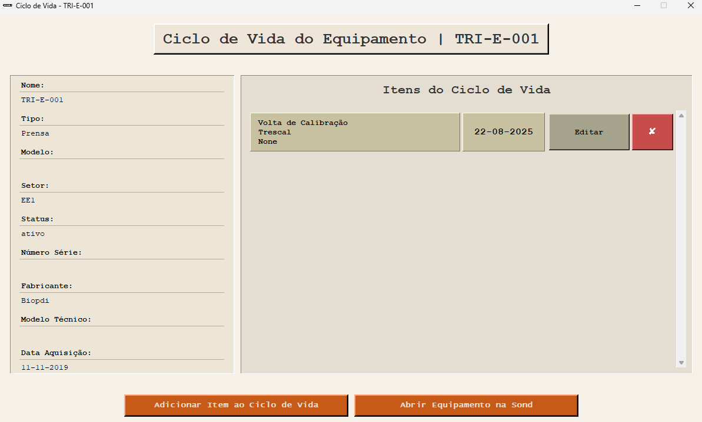

Nesta tela, o usuário encontra:
- Detalhes do equipamento selecionado: Informações como fabricante, descrição, última data de calibração, entre outros.
- Itens do Ciclo de Vida: Registro de todos os acontecimentos relevantes associados ao equipamento.

*Observação: Nem todas as informações do equipamento são visíveis inicialmente. Utilize o "scroll" para acessar todos os demais detalhes.*

O propósito desta tela é fornecer uma visão cronológica completa, do evento mais recente ao mais antigo, sobre o histórico do equipamento. Exemplos de acontecimentos incluem:
- Envio para calibração
- Retorno da calibração
- Quebra ou manutenção
- Outros...

Todos os eventos são exibidos com detalhes à direita, permitindo rápida interpretação.

#### Estrutura da Lista de Itens
Cada evento registrado exibe:
- Categoria do acontecimento: Ex.: “volta de calibração”, “quebrado”, etc.
- Fornecedor: Se o evento estiver relacionado a uma empresa específica.
- Valor: Para eventos com impacto financeiro, como consertos.
- Data: Para identificar rapidamente quando o evento ocorreu.
- Botões de ação: Editar ou excluir o evento, permitindo gerenciamento completo da lista.

#### Criação de Itens do Ciclo de Vida

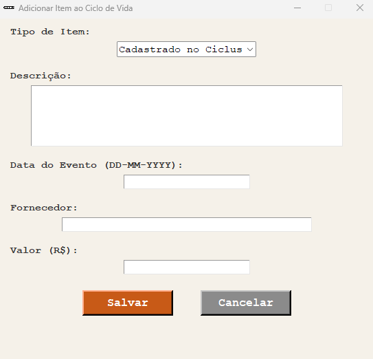

Para registrar um novo evento no Ciclo de Vida de um equipamento, clique em “Adicionar Item ao Ciclo de Vida”. Isso abrirá um formulário que permite cadastrar um acontecimento específico relacionado ao equipamento selecionado.

Ao abrir o formulário, os seguintes campos estarão disponíveis:
- Tipo de Item
- Descrição
- Data do Evento
- Fornecedor
- Valor

*Todos os campos devem ser preenchidos conforme o contexto do acontecimento.*

**Informações Importantes:**
1. Caso o campo Data do Evento seja deixado em branco, a data atual será automaticamente preenchida no momento do salvamento do item.
2. A formatação da data deve seguir dd-mm-yyyy ou dd/mm/yyyy. Formatos diferentes não serão aceitos pelo sistema.
3. Os campos Descrição, Fornecedor e Valor são opcionais e devem ser preenchidos apenas quando necessário para detalhar o acontecimento.

#### Tipos de Item
Cada evento registrado no Ciclo de Vida deve ser categorizado por um Tipo de Item, representando o significado do acontecimento. Atualmente, os tipos disponíveis são:
- Cadastro no Ciclus
- Mudança de Status
- Troca de Setor
- Quebrado / Para Conserto
- Enviado para Calibração
- Enviado para Conserto
- Volta de Calibração
- Volta de Conserto
- Descarte
- Adquirido

*Orientações para acontecimentos não categorizados:*
- Não registrar, caso não seja um evento relevante.
- Escolher o tipo mais próximo possível.
- Solicitar inclusão de um novo tipo a um profissional, apenas se extremamente necessário.

*Alguns tipos de item possuem maior relevância no histórico do equipamento, como Quebrado e Enviado para Calibração, enquanto Cadastro no Ciclus ou Adquirido têm menor prioridade. Sempre priorize o registro de acontecimentos significativos.*

#### Atualização automática de metadados
Ao criar um item do tipo Mudança de Status ou Troca de Setor, uma janela adicional solicitará qual informação do equipamento deve ser atualizada. Após o cadastro do item, o sistema atualizará automaticamente o status ou setor do equipamento, sem necessidade de modificação manual.

---

### Exportação (EXCEL e CSV)

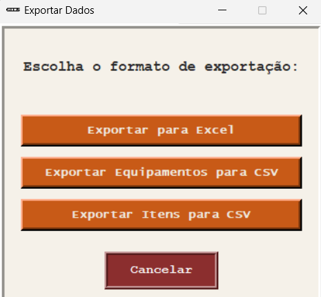

O Ciclus permite a exportação de dados armazenados no banco de dados para Excel ou CSV. Para isso, acesse a aba Equipamentos e clique no botão “Exportar”.

As opções disponíveis são:
- Exportar para Excel
- Exportar Equipamentos para CSV
- Exportar Itens para CSV

Ao selecionar qualquer uma das opções, os arquivos serão gerados nas pastas do software:
- Excel: **data/excel_output**
- CSV: **data/csv_output**

Observações Importante:
- Para Excel há apenas um botão, pois é possível gerar múltiplas tabelas em um único arquivo.
- Para CSV, é necessário criar arquivos separados para equipamentos e itens.
- Caso ocorra algum erro durante a exportação, notifique um superior imediatamente.

---

### Gráficos
A aba Gráficos, localizada na tela de Equipamentos, oferece visualizações que facilitam o entendimento de informações específicas sobre todos os equipamentos cadastrados.

Os gráficos disponíveis são:

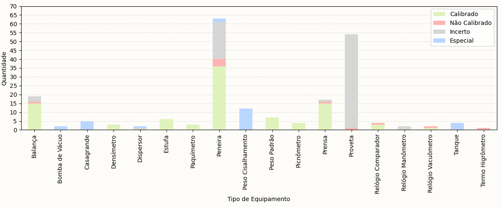

1. **Calibração por Tipo de Equipamento**
    - Tipo: Coluna
    - Cada coluna representa um tipo de equipamento (eixo X) e sua quantidade (eixo Y).
    - As cores indicam diferentes status de calibração.

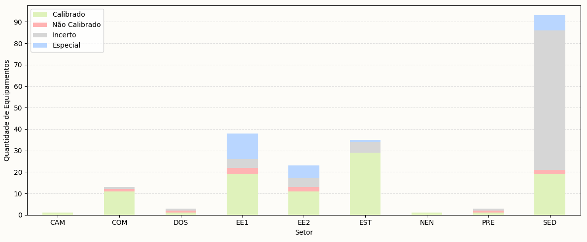

2. **Status de Calibração por Setor**
    - Tipo: Coluna
    - Cada coluna representa um setor e a quantidade de equipamentos nele.
    - As cores indicam os status de calibração dos equipamentos.

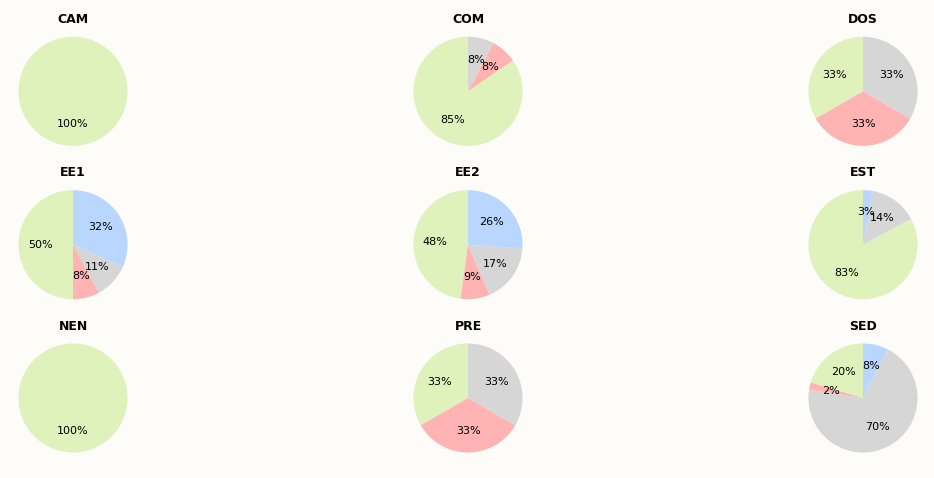

3. **Distribuição de Calibração por Setor**
    - Tipo: Pizza
    - Cada gráfico de pizza representa um setor, mostrando a porcentagem de equipamentos em cada status de calibração.

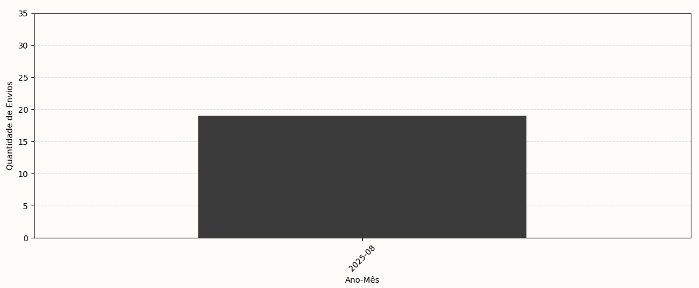

4. **Envios para Calibração por Mês**
    - Tipo: Coluna
    - Cada coluna representa um mês e o eixo Y indica a quantidade de equipamentos enviados para calibração nesse período.

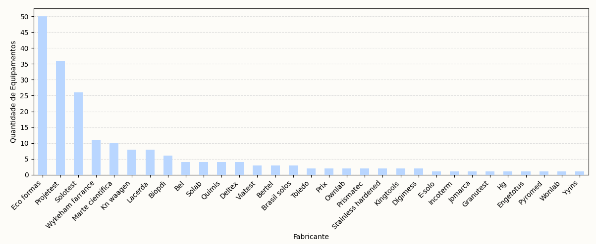

5. **Quantidade de Equipamentos por Fabricante**
    - Tipo: Coluna
    - Cada coluna representa um fabricante único e o eixo Y mostra a quantidade de equipamentos cadastrados.
    - *Atenção: divergências na grafia dos nomes de fabricantes podem gerar múltiplas entradas para o mesmo fabricante.*

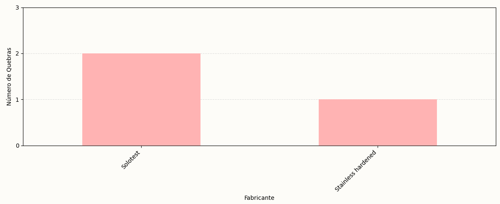

6. **Quebras por Fabricante**
    - Tipo: Coluna
    - Cada coluna representa um fabricante e a quantidade de equipamentos que apresentaram falhas.
    - *Fabricantes sem registros de quebra não são exibidos.*

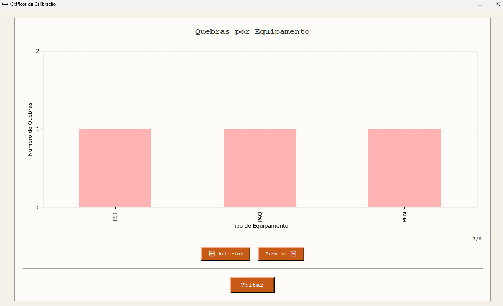

7. **Quebras por Equipamento**
    - Tipo: Coluna
    - Cada coluna representa um tipo de equipamento e a quantidade de quebras registradas.
    - *Categorias sem equipamentos quebrados não aparecem.*

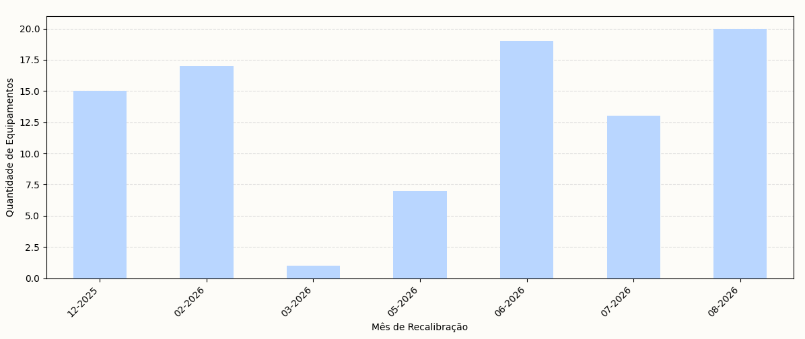


8. **Próximas Calibrações por Mês**
    - Tipo: Coluna
    - Cada coluna representa um mês, a partir do mês atual, mostrando a quantidade de equipamentos cuja calibração expirará nesse período.
---

### Plano de Calibração

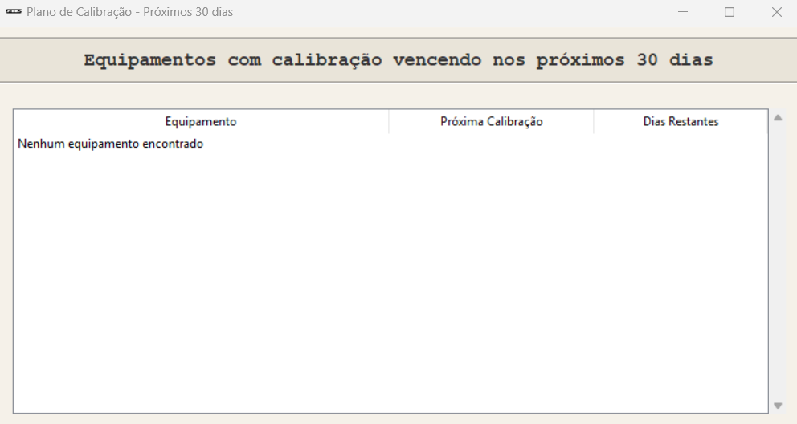

O *Plano de Calibração* oferece uma visão visual detalhada de quais equipamentos precisarão ser calibrados ao longo de um período de um mês.

Para acessar esta funcionalidade, clique no botão “Plano de Calibr.” na janela principal da lista de equipamentos.

---

### Dúvidas
O software pode conter funcionamentos e lógicas que podem gerar confusão e mal entendimento.  
Portanto, quaisquer dúvidas devem ser esclarecidas com um superior ou responsável pelo sistema.

---

## Estrutura do Projeto

Organização de pastas e arquivos:
```
Assets\
    \images
    \logos
controllers\
    \equipamento_controller.py
    \itens_controller.py
data\
    database\
        ciclus.db
        PlanilhaDeEquipamentosAtualizada_5.xlsx
    excel_output\
        equipamentos_itens.xlsx
    csv_output\
        equipamentos.csv
        itens_ciclo_vida.csv
    atualizar_calibracao.py
    atualizar_tipos.py
    exportar.py
    init_db.py
    tipos.py
ui\
    telas_criacao_edicao\
        tela_criacao_ciclo.py
        tela_criacao_equip.py
        tela_edicao_ciclo.py
        tela_edicao_equip.py
    telas_misc\
        tela_plano_calibr.py
        tela_graficos.py
        tela_resumo_calibracao.py
    telas_principais\
        tela_desc_item.py
        tela_equipamentos.py
        tela_itens.py
config.py
helpers.py
main.py
README.md
requirements.txt
roadmap.md
```

## Armazenamento de Dados
A base de dados em SQLite é simples e otimizada para manter o histórico de cada equipamento.
- A tabela equipamentos é a principal e conecta-se a outras por foreign keys.
- Cada equipamento possui um conjunto ilimitado de itens no ciclo de vida.
- A leveza do SQLite garante fácil manutenção e boa performance.


## Controle de Dados
Os controllers centralizam as funções de manipulação e consulta:
- equipamento_controller.py → busca, criação, edição e exclusão de equipamentos.
- itens_controller.py → gerenciamento do histórico de itens dos equipamentos.

Todas as funções incluem tratamento de erros com try/except, garantindo robustez e clareza nas operações.

## Fluxo Geral

O fluxo segue o padrão MVC:
- O usuário interage pela interface (UI).
- O Controller processa a ação e comunica com o banco de dados.
- O Model armazena e retorna os dados atualizados.

Exemplo: ao criar um equipamento, o equipamento_controller.py recebe os dados, conecta-se ao banco e executa a query correspondente.

## Atualizações
Atualizações pendentes para as próximas versões do software podem ser encontradas a baixo:

[ROADMAP](roadmap.md)

## Licença
...

## Contato
Luan de Souza Ferreira Marques

luansfmarques@gmail.com

https://www.linkedin.com/in/luansfmarques/