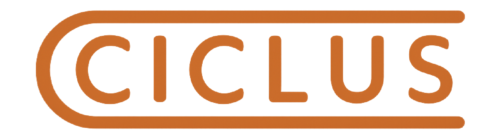
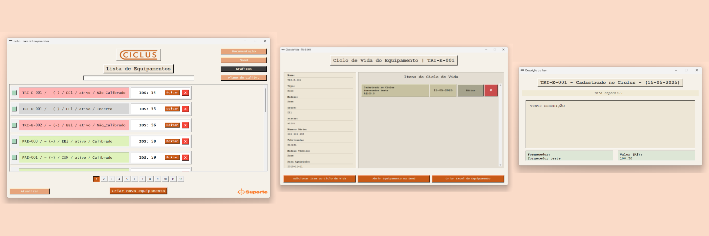
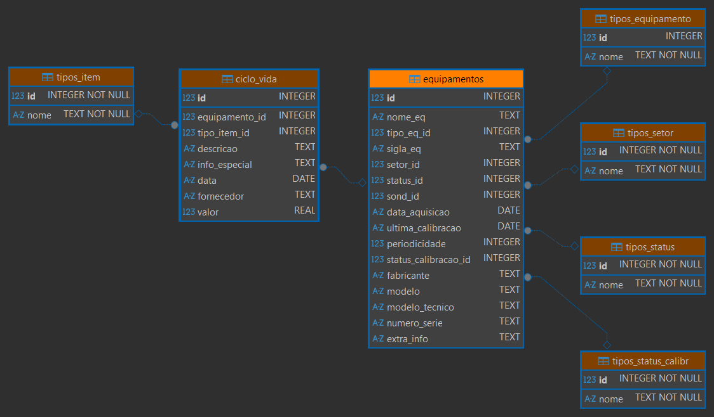
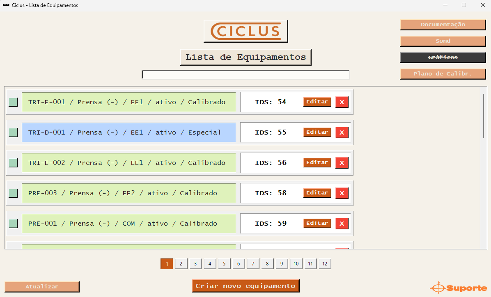
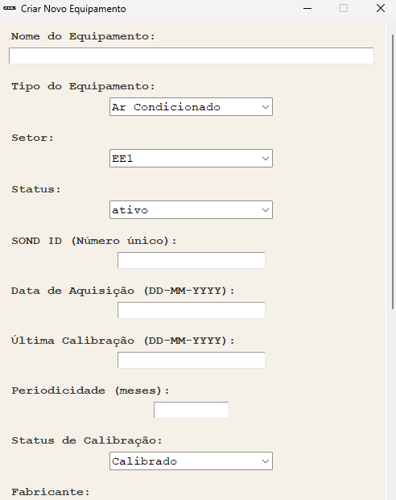
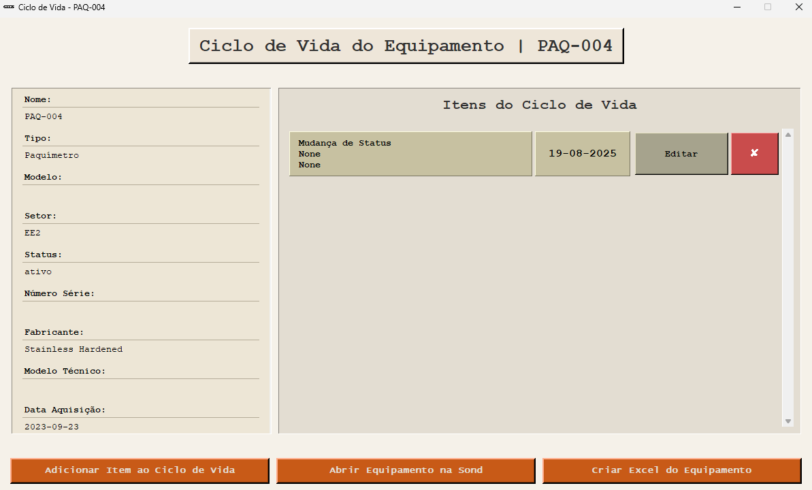
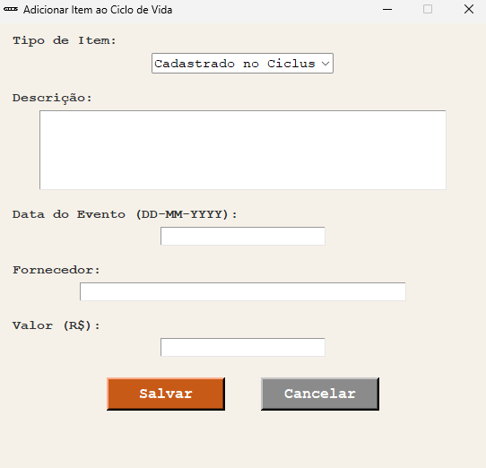
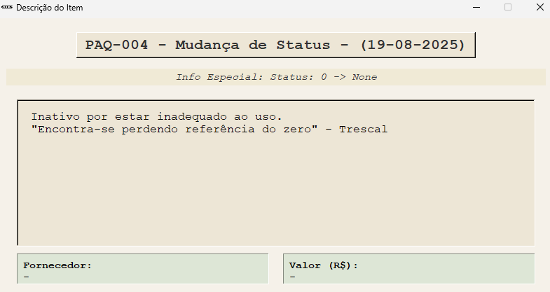

# CICLUS v1.1
*CICLUS* é um software local desenvolvido para o acompanhamento do ciclo de vida de equipamentos laboratoriais na empresa **Suporte**, proporcionando acesso rápido e fácil às informações e oferecendo total visibilidade do histórico e do status de cada equipamento. Seu principal objetivo é permitir pesquisas ágeis e precisas sobre qualquer equipamento.

O software adota o mesmo padrão de identificação e categorização utilizado na aplicação principal da empresa, [**Sond**](https://www.sond.com.br), garantindo consistência e integração com os processos já existentes.

## Funcionalidades Principais

*CICLUS* oferece controle completo do ciclo de vida de equipamentos laboratoriais, permitindo:

- Visualizar rapidamente todos os equipamentos com informações essenciais como status, calibração e modelo.
- Criar e editar equipamentos e registros de histórico de forma ágil e prática.
- Realizar buscas avançadas por múltiplos critérios para localizar equipamentos específicos.
- Acompanhar o histórico de cada equipamento com visão clara e organizada.
- Atualizar automaticamente informações relevantes ao adicionar novos registros, simplificando a manutenção dos dados.


## Tecnologias Utilizadas
- **Python**: Linguagem principal do software
- **TKinter**: Criação da interface gráfica.
- **SQLite3**: Banco de dados local para armazenamento rápido e leve.

## Como Usar

1. Clone o repositório:
```bash
git clone https://github.com/LuanSFMarques/CICLUS
```

2. Navegue até a pasta do projeto:
```bash
cd CICLUS
```

3. instale dependências:
```bash
pip install -r requirements.txt
```

4. execute o programa:
```bash
python main.py
```
ou
```bash
py main.py
```

## 📂 Estrutura do Projeto

O projeto segue a arquitetura MVC (Model-View-Controller):
- Model (Data): armazenamento em SQLite3.
- View (UI): interface gráfica com Tkinter.
- Controller: funções Python que interagem entre interface e banco de dados.

Organização de pastas e arquivos:
```
Assets\
    \images
    \logos
controllers\
    \equipamento_controller.py
    \itens_controller.py
data\
    database\
        ciclus.db
        PlanilhaDeEquipamentosAtualizada_t.xlsx
    atualizar_calibracao.py
    atualizar_tipos.py
    excel_para_sqlite.py
    init_db.py
    sqlite_para_excel.py
    tipos.py
ui\
    telas_criacao_edicao\
        tela_criacao_ciclo.py
        tela_criacao_equip.py
        tela_edicao_ciclo.py
        tela_edicao_equip.py
    telas_misc\
        tela_plano_calibr.py
    telas_principais\
        tela_desc_item.py
        tela_equipamentos.py
        tela_itens.py
helpers.py
main.py
```

## 🗄 Armazenamento de Dados (Model)
A base de dados em SQLite é simples e otimizada para manter o histórico de cada equipamento.
- A tabela equipamentos é a principal e conecta-se a outras por foreign keys.
- Cada equipamento possui um conjunto ilimitado de itens no ciclo de vida.
- A leveza do SQLite garante fácil manutenção e boa performance.



## 🔧 Controle de Dados (Controllers)
Os controllers centralizam as funções de manipulação e consulta:
- equipamento_controller.py → busca, criação, edição e exclusão de equipamentos.
- itens_controller.py → gerenciamento do histórico de itens dos equipamentos.

Todas as funções incluem tratamento de erros com try/except, garantindo robustez e clareza nas operações.

## 🖥 Interface Gráfica

A interface foi projetada para ser clara e funcional, com uma estética retrô e uso de cores para facilitar a navegação.

### Tela de Equipamentos

- Status do equipamento:
    - Verde → Ativo
    - Vermelho → Inativo
- Condição de calibração:
    - Verde → Calibrado
    - Vermelho → Não calibrado
    - Cinza → Incerto
    - Azul → Especial



### Criação de Equipamentos
Formulário para registro de novos equipamentos, com campos obrigatórios e opcionais.



### Itens do Ciclo de Vida
Lista cronológica dos eventos relacionados a cada equipamento.



### Criação de Itens
- Data automática inserida caso o campo fique vazio.
- Atualização automática de status ou setor ao criar itens específicos.



### Descrição de Itens
Detalhes adicionais sobre cada ocorrência no histórico.



## 🔄 Fluxo Geral (UI / CONTROLLERS / DATA)

O fluxo segue o padrão MVC:
- O usuário interage pela interface (UI).
- O Controller processa a ação e comunica com o banco de dados.
- O Model armazena e retorna os dados atualizados.

Exemplo: ao criar um equipamento, o equipamento_controller.py recebe os dados, conecta-se ao banco e executa a query correspondente.

## 🆕 Atualizações
Atualizações pendentes para as próximas versões do software podem ser encontradas a baixo:
[ROADMAP](roadmap.md)

## 📜 Licença
...

## 👤 Contato
Luan de Souza Ferreira Marques

luansfmarques@gmail.com

https://www.linkedin.com/in/luansfmarques/